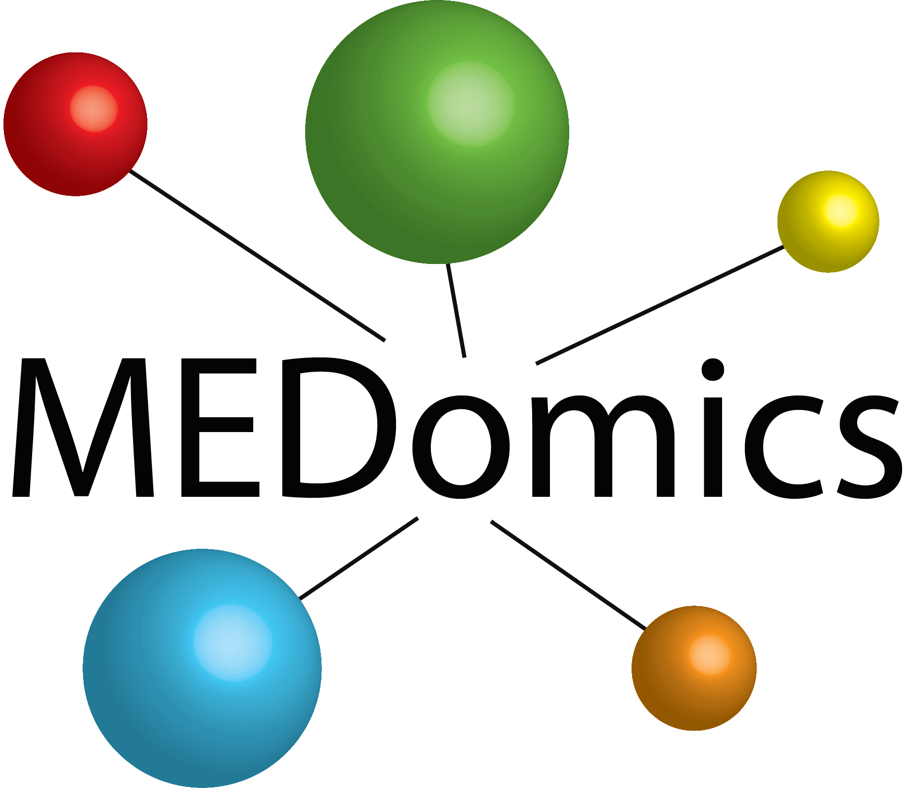

 

# MEDomics - Nature Cancer Study

This repository provides the framework to reproduce the main learning experiments of the MEDomics manuscript submitted to <em>Nature Cancer</em> in April 2020. Improvements from contributors are expected over time and will be identified via specific commit checkpoints. The exact results produced by this framework may eventually slightly differ from the original ones found in our study over the different checkpoints. 

## Using this repository

This repository is subdivided into three main high-level experiments:
* Experiment1_KM: section used to reproduce the test experiments of current Figure 4 of the manuscript. 
* Experiment2_ML: section used to reproduce the test experiments of current Figure 5 of the manuscript.
* Experiment3_NLP: section used to reproduce the test experiments of current Figure 6 of the manuscript.

Please follow the instructions in the README file of each section. 

## Contributing to this repository

We would love to receive feedback to improve the learning experiments of this repository. To contribute, please follow these steps:

1. Fork this repository.
2. Create a branch: `git checkout -b <branch_name>`.
3. Make your changes and commit them: `git commit -m '<commit_message>'`
4. Push to the original branch: `git push origin <project_name>/<location>`
5. Create the pull request.

Alternatively see the GitHub documentation on [creating a pull request](https://help.github.com/en/github/collaborating-with-issues-and-pull-requests/creating-a-pull-request).

## Contributors

Thanks to the following people who have contributed to this repository:

* [Olivier Morin](https://github.com/OlivierMorinUCSF)
* [Martin Vallières](https://github.com/mvallieres)
* Steve Braunstein
* [Jorge Barrios Ginart](https://github.com/numeroj)
* [Taman Upadhaya](https://github.com/TmnGitHub)
* [Henry Woodruff](https://github.com/hwoodruff)
* [Alex Zwanenburg](https://github.com/alexzwanenburg)
* [Avishek Chatterjee](https://github.com/avieinstein)
* Javier Villanueva-Meyer
* Gilmer Valdes
* William Chen
* Julian C. Hong
* Sue S. Yom
* Timothy Solberg
* Steffen Lock
* Jan Seuntjens
* Catherine Park
* Philippe Lambin 

## Contact

For any scientific inquiries about this repository, please contact <medomics.info@gmail.com>.

## STATEMENT

 This file is part of <https://github.com/medomics>, a package providing research utility tools for developing precision medicine applications. 
 
 --> Copyright (C) 2020  MEDomics consortium

     This package is free software: you can redistribute it and/or modify
     it under the terms of the GNU General Public License as published by
     the Free Software Foundation, either version 3 of the License, or
     (at your option) any later version.

     This package is distributed in the hope that it will be useful,
     but WITHOUT ANY WARRANTY; without even the implied warranty of
     MERCHANTABILITY or FITNESS FOR A PARTICULAR PURPOSE.  See the
     GNU General Public License for more details.
 
     You should have received a copy of the GNU General Public License
     along with this package.  If not, see <http://www.gnu.org/licenses/>.
